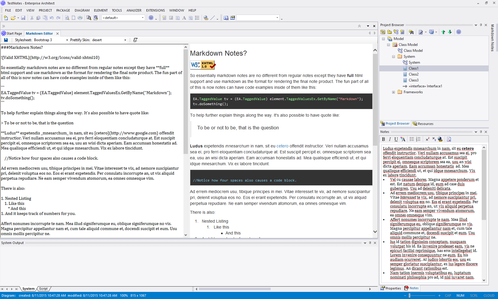
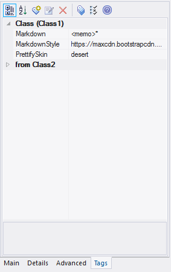

# EA Power Tools
This project is a Visual Studio 2015 project that adds some new features to Sparx System EA. In order to use this
project (until an installer is made) you will have to add a registry key and restart EA to see the addin appear. Basically the EA Addin process goes like this:

1. Create and Sign an Assembly Implementing The Proper COM Methods
2. Place It In The GAC
3. Add a registry entry so EA will load it.
4. Profit

There are two ways to install it:

1. Get the latest installer from [here](https://github.com/PlasmaTrout/EAPowerTools/raw/master/Output/EAPowerTools-Alpha1.exe)
2. Manually build the project in VS run as administrator and then manually add the registry key.

## How To Use It
Right now as I am hacking on it, there are a few main features that were needed first.

1. A traceability report view that could be exported to excel
1. A better way to edit pasted in documentation by stripping spaces and formatting lists and paragraphs using html markup.
2. A markdown enabled comment section, independent of the notes column.
3. A markdown editor for the new comment types.
4. A markdown addin dockable window to help show the markdown comments in a convienient way.

### Traceability Report


To use the traceability report simply click on the element in either the project browser or the diagram itself. Right click and choose
```Extensions -> EA Power Tools -> Traceability Report```. In a few seconds you should see your report come up. I typically group 
by the Traversal field which allows me to seperate the direction in which the link is found. All links are shown to/from and links without
directions will show direction "unspecified". The traversal field may be a little bit alien but heres some tips:

* A traversal of **initial** means all of the elements that are pointed to by the element you clicked on.
* A traversal of **forwards** means that is continued to go in a forward direction from the element you selected and found more connections.
* A traversal of **backwards** means that is found links pointing backwards from an element that you may not be aware of. This
mean these elements are affected as well.

_Frequently you will find connections in the forward and backwards category that are the same. This is because of multi-direction connections_

### Power Editor


The power editor is an html markup editor that allows you access to the markup that the notes column itself won't give you. This allows you
have tools that will surround pasted in material with ```<ol>``` and ```<li>``` tags along with much more.

EA only supports a limited markdown capacity. So adding things like divs and images will not work. However spans and paragraphs do have limited functionality.
Unfortunately OL types don't function in the notes field so having roman numerals or lettered lists is currently not possible.

### Markdown Comments



I am slowly adapting EA to use markdown output as a generation mechanism so that I can generate class documentation for API's in a github/bitbucket centric way. The first step, however, was to add a markdown comments section to each element. I do this by creating a taggedvalue for Markdown and MarkdownStyle. Where style is the cdn url of the stylesheet you wish to use when viewing the comments.



To edit the markdown comments use ```Extensions -> EA Power Tools -> Markdown Editor``` and you will get a down and dirty editor (which is still being worked on). If you just want to see what comments exist for an element, you can add the Addins Window to your dock somewhere and then go ```Extensions -> EA Power Tools -> Markdown Addin Windows``` and it will show up.


## REGISTRY
- To setup the registry, we need to start Regedit and find the ```HKEY_CURRENT_USER\Software\Sparx Systems\EAAddins``` directory.
- Add a new key with the name the same as your namespace. In our case it is EAPowerTools 
- The value for the key should be your project name followed by your entry point. 
- In our case the value would be: CS_AddinFramework.Main

## REGEDIT EXPORT
 [HKEY_CURRENT_USER\Software\Sparx Systems\EAAddins\EAPowerTools]
 @="EAPowerTools.Main"
